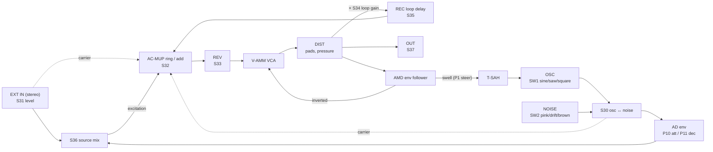

# TouchVink

A feedback instrument for the **Synthux Simple Touch**, after the self-regulating tape/ring-mod/reverb patches of **Jaap Vink** (Institute of Sonology). One knob, one function.

A delayed copy of the output is ring-modulated, reverberated and passed through a VCA that is turned *down* by the loop's own loudness. That compressor lets the loop run above unity gain without blowing up, so it keeps moving by itself. Pads excite the loop, set the oscillator pitch, pick a distortion, or let the loop "steer" its own oscillator.

> Status: v0.1 — compiles for the Daisy Seed, DSP tested on desktop, **not yet tested on hardware**. See `docs/PLAN.md`.

## Signal flow



## Controls

| | |
|---|---|
| **S30** | Internal source: osc ↔ noise |
| **S31** | External input level (0 → +12 dB) |
| **S32** | Ring modulation: loop straight ↔ loop × carrier |
| **S33** | Reverb |
| **S34** | VCA / loop gain — above ~60 % the loop sustains itself |
| **S35** | Loop delay, 2 ms (pitched comb) → 1.9 s (tape echo) |
| **S36** fader | Source: external ↔ internal |
| **S37** fader | Output level |
| **SW1** | Osc shape: sine / saw / square |
| **SW2** | Noise: pink / pink↔brown drift / brown |
| **P0** | Pads → OSC mode (LED 1 blink) |
| **P2** | Pads → DIST mode (LED 2 blinks) |
| **P1** | Steering: tap = latch on/off, hold = momentary |
| **P3–P9** | OSC mode: pick pitch (0.8, 5, 27.5, 55, 110, 220, 440 Hz) + excite; pressure bends up to +1 oct |
| | DIST mode: clean, soft, hard, fold, half-rect, full-rect (octave), crush; pressure = drive |
| **P10** | Attack step: 2 ms / 60 ms / 600 ms |
| **P11** | Decay step: 120 ms / 900 ms / drone |
| **P10 + P11** 1 s | Recalibrate pads |

## Build

```bash
git clone --recurse-submodules <this repo>
make libs      # once
make           # build/TouchVink.bin
make program-dfu
```

Uses the **Synthux fork of libDaisy** and DaisySP (with DaisySP-LGPL for the reverb), as submodules.

### Listen without hardware

```bash
make -C host && ./host/render    # run from the repo root, writes host/out/*.wav
```

## Layout

```
TouchVink.cpp        main: audio callback, pad/knob/switch logic, LED
common/config.h      every tunable number
dsp/engine.*         the Vink loop (portable, no libDaisy)
dsp/blocks.h         small DSP blocks: noise colours, env follower, AD, delay, distortion
hw/simple_touch.*    knobs, switches, MPR121 pads with pressure + velocity
host/                desktop renderer for listening tests
docs/SKETCHES.md     notebook sketches translated, with every interpretation marked
docs/PLAN.md         bring-up checklist, tuning, filter options, roadmap
```

## Credits

- Jaap Vink — the original patch and technique
- [AudreyTouch](https://github.com/Synthux-Academy/AudreyTouch) (Nick Donaldson / Infrasonic, Synthux Academy) — Simple Touch feedback-synth structure
- [TouchString](https://github.com/vincentltm/TouchString) (vincentltm) — MPR121 pressure-sensing approach
- [libDaisy (Synthux fork)](https://github.com/Synthux-Academy/libDaisy), [DaisySP](https://github.com/electro-smith/DaisySP)
